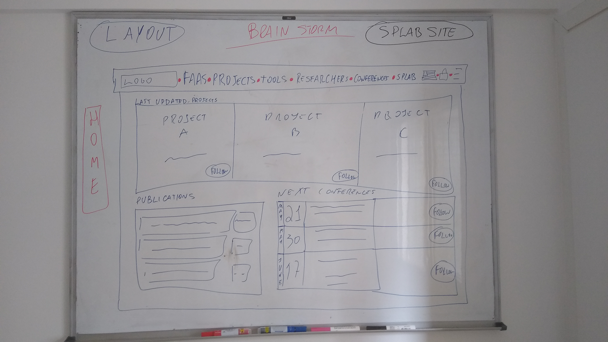
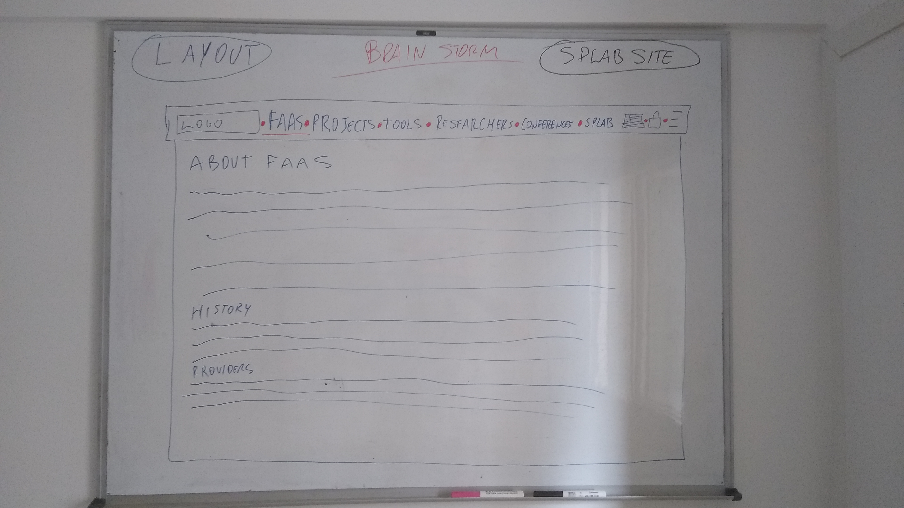
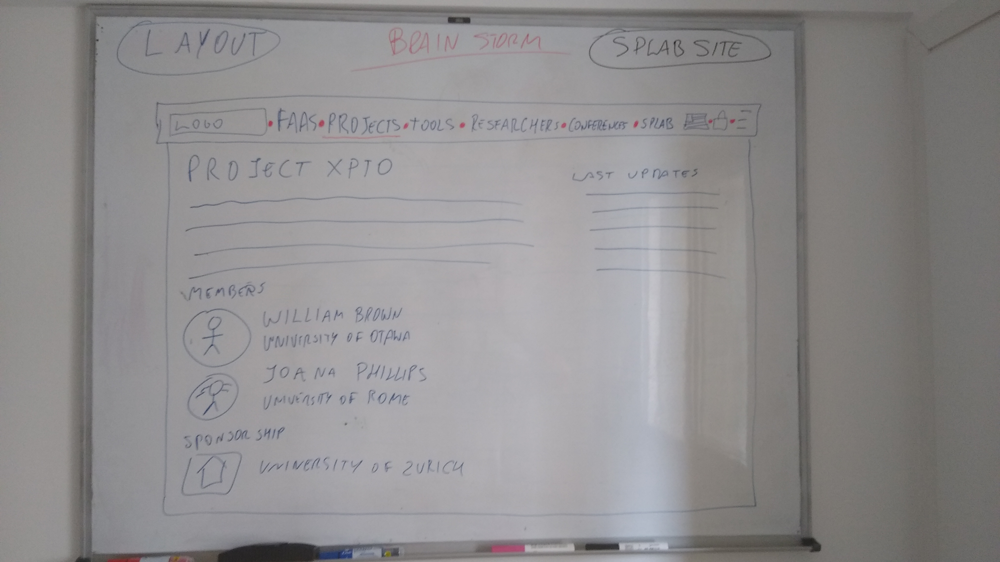
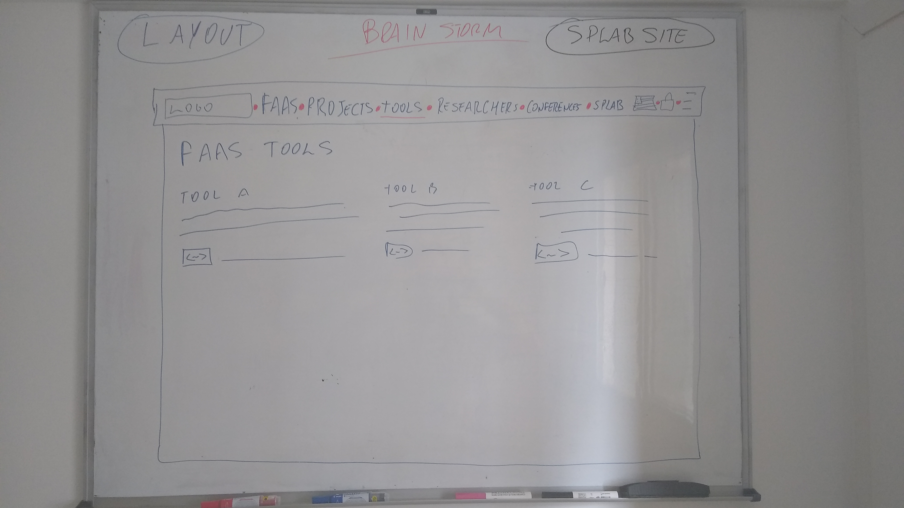
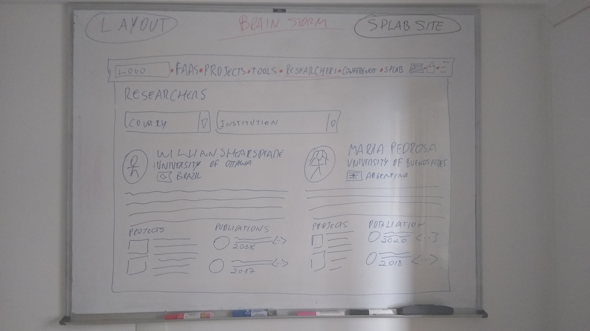
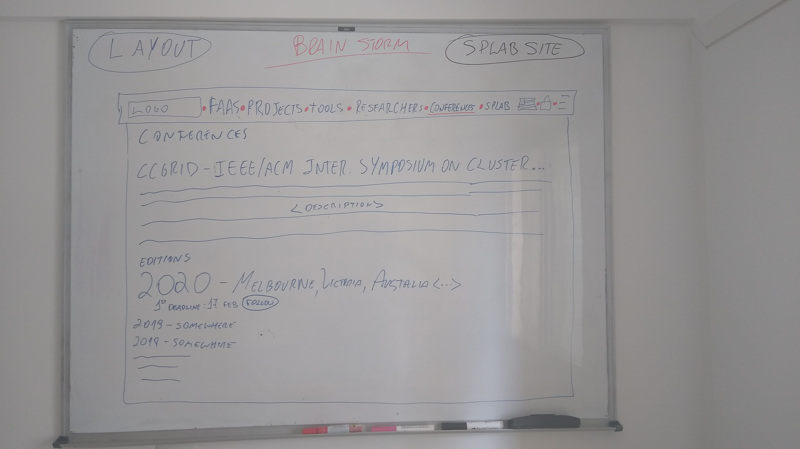
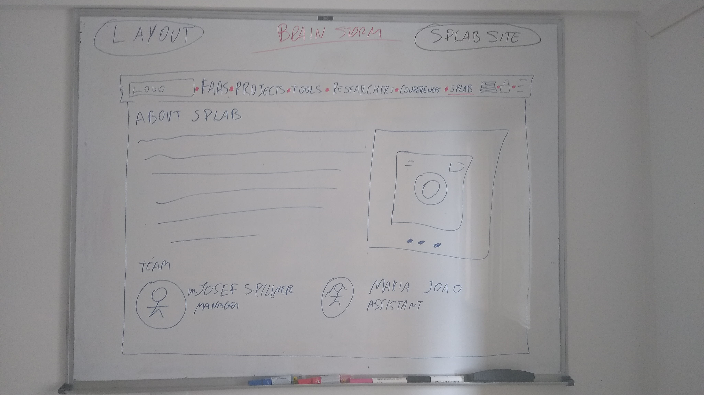
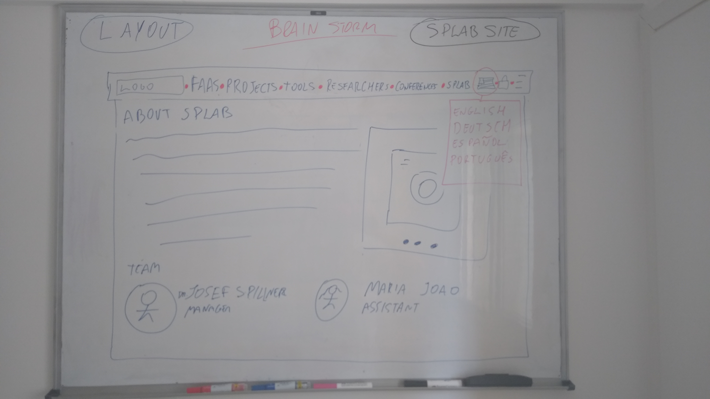
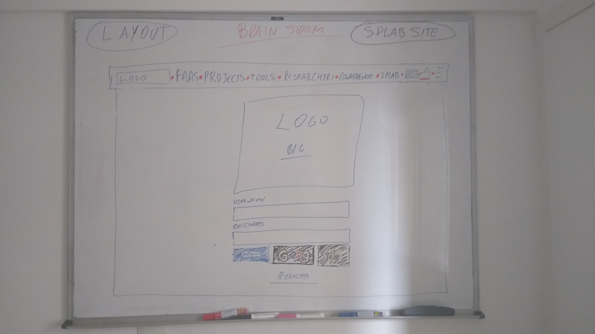
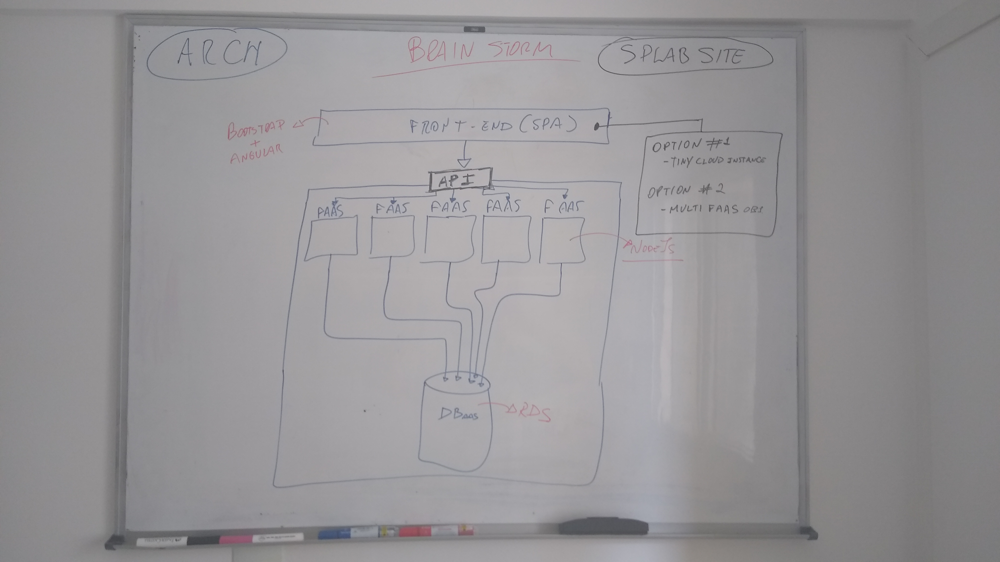

# FaaS Projects Site of SPLabs

## BrainStorm

#### 1 - HOME

The home page of the site will be composed by a topbar with these submenus:
  - **FaaS** (link to other page with informations about Function as a Service);
  - **Projects** (link to other page listing projects related to FaaS)
  - **Tools** (link to other page listing some tools in Faasification process, such as: case of tests databases, frameworks, and others)
  - **Researchers** (link to other page listing all people involving in the FaaS projects)
  - **Conferences** (link to other page listing conferences related to Cloud)
  - **SPLabs** (link to other page with information about SPLabs)
  - **Internationationalization** (change language of the site)
  - **SignIn** (Get logged on the site, link to other page)

Inside the content area will be shown the three projects that had been updated recently and buttons on each project to follow them. More below will be shown a list of publications related of FaaS and a schedule of the next conferences.

#### 2 - FAAS

The FaaS page brings some information about this topic. A lithe bit of history and a overview of the providers and its services. This page will be essencially informative.

#### 3 - PROJECTS

Firstly will be shown a list of the projects. Then, the user choose a specific project and will be shown a description of the project, last updates, it members and sponsorships. Should be possible to add pictures inside the description of the project to ilustrate better.

In this page should be possible to click to follow the project.

#### 4 - TOOLS

This page shows a list of tools, a brief description of them and links to access each tool or download them.

#### 5 - RESEARCHERS

This page shows a list of researchers the is member in the projects shown on the site. It will be possible to filter them by country and institution.

#### 6 - CONFERENCES

This page shows in details the conferences related on Cloud. For each conference it will be shown the list of last editions and the place where was based. If there´s a deadline comming the date should be shown too. Should be possible to follow the conference on this page.

#### 7 - SPLABS

This page brings informations about the SP Labs. Pictures, team, etc.

#### 8 - Flag for Internationationalization

On click will be shown a submenu to choose the language.

#### 9 - Login

The login page will enable users gets registered on the site and receive communications such as informatives about projects or deadline changes on conferences for example. Should be possible to signup on the site using one of these methods:
  - Register form;
  - Google Account;
  - GitHub Account.

***

#### Architecture

- **FrontEnd** (Single Page Aplication - Bootstrap + Angular)
  - Could be hosted in a tinny cloud instance; or
  - Could be segmented in multiple FaaS objects
    - Users sessions could be managed in Database
- **BackEnd**
  - API
    - Multiple FaaS deployments (at least one for each conceptual database object)
      - Each FaaS will comunicate with the Database to process the request
  - Database
    - Any DBaaS, such as RDS

